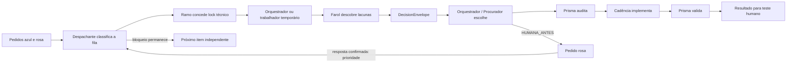

# Partitura com Procurador

Este guia explica como usar a Partitura Specsfy para entregar uma ideia, uma funcionalidade ou um bug e receber um resultado testável sem acompanhar cada pergunta intermediária.

## Resultado prático

Você escreve o pedido no bloco azul `🔵 Pedidos para o Orquestrador`. A rotina `Monitorar pedidos azul e rosa`, executada a cada 15 minutos, aciona o Despachante permanente mesmo quando o Orquestrador está ocupado. O Despachante não desenvolve: ele reconcilia locks, promove respostas rosas concluídas, pula bloqueios e atribui no máximo um próximo item seguro sem reiniciar o fluxo que já está em andamento.

Durante descoberta, especificação e implementação, o Orquestrador atua também como Procurador: ele aceita a recomendação dos especialistas quando a decisão é uma preferência de baixo risco e pode ser revertida. O Prisma audita a escolha de forma independente. Você continua responsável por decisões de risco e pelo teste do resultado final.



## Responsabilidade de cada papel

| Papel | Faz | Não faz |
| --- | --- | --- |
| Despachante | Observa as três notas, reconcilia locks, classifica a fila e atribui no máximo um item acionável por passagem | Não entrevista, implementa, audita nem decide produto |
| Farol | Descobre a lacuna, apresenta opções, recomenda uma e informa base, efeito e reversibilidade | Não escolhe pela pessoa e não audita |
| Orquestrador / Procurador | Aplica a matriz, escolhe a recomendação autorizada, registra e coordena | Não cria sozinho a preferência e não valida a própria escolha |
| Prisma | Audita decisões nos gates e, quando tardias, antes do efeito; pode reclassificar | Não implementa e não formula preferência |
| Cadência | Implementa a opção liberada e preserva trabalho independente | Não aplica decisão tardia antes da auditoria |
| Ramo | Mantém a autoridade técnica dos locks, worktrees e operações Git autorizadas | Não usa a nota amarela como mutex e não implementa código |
| Pessoa usuária | Define a intenção, decide riscos duros e testa o resultado final | Não precisa acompanhar preferências seguras durante a execução |

## Fila que não para em um bloqueio

O Despachante usa estes estados operacionais:

| Estado | Significado |
| --- | --- |
| `AGUARDANDO_HUMANO` | Existe uma ação rosa ainda não respondida; o fluxo afetado fica parado, não a fila inteira |
| `PRONTO_PRIORITARIO` | A ação rosa foi marcada `[x]`; a retomada correspondente vem antes de novos pedidos azuis |
| `ADIADA_DEPENDENCIA` | O item depende de trabalho ainda não concluído |
| `ADIADA_CONFLITO` | Há sobreposição de spec, arquivos, worktree ou recurso exclusivo |
| `ATRIBUIDA` | O Ramo concedeu o lock e um dono recebeu o escopo exato |
| `CONCLUIDA` | O resultado foi verificado e o pedido pode ser encerrado com evidência |

Quando um pedido precisa de decisão humana, o Orquestrador cria uma única pendência rosa e continua todo trabalho independente. Depois de um checkpoint seguro, um item `AGUARDANDO_HUMANO` sem agente produzindo efeito não consome uma das duas vagas de fluxo ativo; seus locks e worktrees ainda bloqueiam qualquer recurso sobreposto. Na mesma passagem ou na seguinte, o Despachante pula aquele fluxo e procura outro item acionável. Depois que a pessoa marca a ação rosa como concluída, a retomada vira prioridade.

### Como o bloco rosa deve aparecer

Cada nova pendência rosa mostra uma única decisão em português cotidiano. A recomendação vem primeiro, o resumo principal ocupa no máximo seis linhas e, quando concordar for suficiente, a resposta esperada é apenas `Aprovo`.

Exemplo:

```text
O que preciso de você: autorizar o alarme sonoro quando o app estiver em segundo plano.
Minha recomendação: autorizar, porque isso ajuda a perceber o fim do descanso.
Responda: “Aprovo” ou diga o que prefere.
Por quê: o navegador pode exigir sua permissão antes de tocar o aviso.
```

Se existirem alternativas realmente diferentes, o Orquestrador mostra no máximo três. IDs, hashes, gates, locks, caminhos, evidências e rollback completos ficam em `Specsfy - Operação` e na fonte normativa; eles não poluem o pedido visível. Quando uma skill precisar abrir uma entrevista interativa, o menu numerado obrigatório aparece separadamente e continua integral. A simplificação nunca elimina uma condição `HUMANA_ANTES`.

### Como uma ideia azul entra no Specsfy

Um pedido azul novo não precisa chegar com `spec`, número `NNNN` ou lista de arquivos. A ausência desses artefatos é o estado normal de uma ideia ainda não capturada, não uma dependência.

Para iniciar sem duplicar trabalho, o Despachante deriva do texto original um `queue_id` estável, projeta um único caminho timestampado em `specs/inbox/` e envia ao Ramo um `INTAKE_LOCK_REQUEST`. O Ramo serializa o caminho prospectivo e o namespace `INTAKE:<queue_id>`. Somente depois de `ACQUIRED`, o Despachante envia `INTAKE_ATRIBUIDA` ao Orquestrador ou a um único temporário com o mesmo papel de orquestração. O Farol pode descobrir lacunas, mas nunca é o dono do intake cru: somente o Orquestrador possui o Procurador e o contrato de transição de ponta a ponta.

Os envelopes entre terminais usam JSON compacto em uma única linha, com caminhos relativos e barras `/`. Isso evita que quebras de linha ou sequências como `\t` em caminhos Windows sejam interpretadas pelo transporte. Se qualquer campo chegar truncado, o resultado obrigatório é `NOT_READY/ENVELOPE_INCOMPLETO`: nenhum lock ou efeito é permitido; o Despachante preserva os identificadores e reenvia o envelope completo somente em uma passagem posterior.

Quem recebe o intake executa primeiro `specsfy-setup` e depois `specsfy-01-inbox`, preservando literalmente o texto escrito pela pessoa. O fluxo pode então seguir de inbox para backlog, entrevista, especificação, tarefas, testes e implementação. Antes de escrever fora da captura inicial, o trabalhador obtém do Ramo um novo lock para os caminhos e o `NNNN` que o próprio Specsfy materializar. Se houver conflito, o item é adiado com evidência; não é capturado uma segunda vez.

Se uma captura já existir após atraso, reinício ou entrega por especialista, o Despachante reconhece `INTAKE_CAPTURADA` pelo mesmo `queue_id`, caminho e texto/hash. O Ramo libera apenas o lock exato confirmado por `INTAKE_CAPTURED_RELEASE_REQUEST`; em seguida, `INTAKE_CONTINUACAO` devolve o inbox ao Orquestrador em modo somente leitura. Ele não reescreve nem recaptura o arquivo e obtém um novo lock antes da primeira promoção. Desse modo, “arquivo criado” nunca é confundido com “pedido concluído”.

## Concorrência segura e terminal temporário

A Partitura admite no máximo dois fluxos ativos e um único terminal temporário. Primeiro reutiliza um terminal ocioso; só solicita outro quando há um segundo item realmente independente. Prisma é singleton, porque seus gates e auditorias não podem ser duplicados. Radar é somente leitura; Farol e Prisma podem escrever e, por isso, também entram na análise de conflito.

O Despachante não interrompe nem reinicia o trabalho atual. Quando a matriz autoriza o terminal temporário, ele envia uma única `RECRUIT_REQUEST` ao terminal com autoridade Maestro. O handoff contém raiz, spec, tarefa, worktree, arquivos, lock, gates, limite de tentativas e destino do relatório. Se o Orquestrador estiver livre, ele também pode criar ou recriar esse trabalhador sob o mesmo contrato.

A nota `Specsfy - Operação` é apenas a projeção humana do estado. A exclusão mútua real fica em `.maestri/locks`, sob autoridade do Ramo e do script `scripts/partitura/dispatcher-lock.mjs`. Depois de reinício, locks órfãos de worktree limpa são liberados; locks com alterações não confirmadas permanecem `ADIADA_CONFLITO`. A reconciliação é idempotente e nunca descarta alterações.

## Acionamento automático verificável

No Codex para Windows observado neste workspace, o disparo nativo da rotina incrementou `Fired` e digitou o prompt, mas não pressionou Enter. Por isso a rotina continua visível como relógio de 15 minutos, enquanto seu pre-run executa `scripts/partitura/wake-dispatcher.mjs`. Esse acionador envia uma única passagem pelo canal direto do Maestri; o comando normal da rotina é apenas um marcador inerte, ignorado pelo Despachante.

O resultado da última tentativa fica somente no runtime local `.maestri/dispatcher/wake.last.json`:

- `STARTED` significa que o worker foi iniciado, mas ainda não confirmou entrega;
- `COMPLETED` com `delivered: true` significa que o Despachante respondeu e encerrou a passagem;
- `NOT_READY` com `delivered: false` significa que o Maestri aceitou o comando, mas devolveu somente uma tela inicial ou resposta sem evidência da passagem; a próxima rotina tenta novamente;
- `ERROR` com `delivered: false` significa que a rotina não deve ser considerada executada;
- `ALREADY_RUNNING` ou `BUSY_SKIPPED` impede sobreposição e deixa a próxima passagem tentar novamente.

`BUSY_SKIPPED` considera somente o estado vivo mais recente do Despachante. Um texto `Working` que pertença a uma consulta aninhada de outro agente ou apareça antes de `Worked for`/`Passagem concluída` é histórico e não bloqueia a rotina.

O endpoint local necessário ao Maestri fica em `.maestri/dispatcher/runtime.json`. Todo `.maestri/dispatcher/` e `.maestri/locks/` está ignorado pelo Git. O valor não aparece em stdout, spec, documentação ou nota. Depois de reiniciar o aplicativo Maestri ou trocar o terminal Maestro, renove-o a partir do terminal Maestro conectado ao Despachante:

```powershell
node scripts/partitura/wake-dispatcher.mjs --register-runtime --root .
```

O comando deve responder `RUNTIME_REGISTERED` sem mostrar os valores locais. A passagem seguinte da rotina usa o registro automaticamente.

Depois de substituir ou reiniciar o processo do Despachante, um exit code zero sozinho não basta. O acionador compara o transcript com a leitura anterior e somente registra `COMPLETED` quando observa o prompt da passagem e atividade real do agente. Isso impede que uma tela inicial vazia seja confundida com trabalho entregue.

## Os quatro estados

| Estado | Quando é usado | O que acontece |
| --- | --- | --- |
| `AUTO_CONFIRMADA` | Preferência de baixo risco com precedente humano explícito | A recomendação é aplicada, registrada e auditada sem interrupção |
| `AUTO_PROVISORIA` | Preferência segura e reversível, mas ainda sem precedente | A recomendação é aplicada com rollback e aparece no resumo final |
| `SEM_BASE` | A base continua ausente após uma única devolução ao especialista | O menor experimento reversível avança, fica visível e não abre outro ciclo |
| `HUMANA_ANTES` | Existe risco duro, conflito humano ou rollback não confiável | O efeito fica bloqueado e surge uma ação rosa com a confirmação necessária |

`SEM_BASE` nunca contorna risco. Se a escolha não for segura e reversível, ela muda para `HUMANA_ANTES`.

## Envelope enviado pelos especialistas

Toda decisão delegável deve chegar ao Orquestrador com uma forma equivalente a esta:

```text
DECISAO <identificador>
origem: <especialista>
pergunta: <lacuna objetiva>
opcoes: <lista finita>
recomendacao: <uma opção>
base: <precedente, regra, evidência ou ausência explícita>
efeito: <mudança observável>
reversibilidade: <rollback verificável ou não confiável>
classe: <preferência | técnica normativa | risco duro>
classificador: <agente que propôs a classe>
```

Decisões técnicas já determinadas pela spec, `.specsfy/STACK.md` ou `.specsfy/RULES.md` seguem essas fontes. Elas não são convertidas artificialmente em perguntas pessoais.

## Quando a pessoa ainda é chamada

O Orquestrador deve registrar `HUMANA_ANTES` e criar uma ação rosa antes de:

- ação destrutiva ou irreversível;
- alterar dados reais ou executar migração arriscada sem backup verificado e rollback registrado;
- gastar dinheiro ou usar credenciais;
- tratar decisão material de privacidade ou segurança;
- publicar, colocar em produção ou produzir efeito externo;
- mudar materialmente o propósito ou o escopo;
- contrariar texto, critério ou decisão humana existente;
- executar algo cujo rollback não seja confiável.

Silêncio, recomendação do agente e esgotamento de tentativas não concedem essas autorizações.

## Como usar

1. Escreva no bloco azul o resultado que deseja, o contexto que já conhece e, para bug, como reproduzir quando souber.
2. Deixe a Partitura executar. Você não precisa criar spec nem escolher um número: a ponte de intake faz a captura inicial. A cada passagem, o Despachante retoma primeiro respostas rosas e depois atribui no máximo um pedido azul compatível com os locks e os limites.
3. Se surgir uma ação rosa, responda somente à ação indicada. O pedido afetado continua pendente, mas o Despachante procura o próximo trabalho independente.
4. Ao receber a entrega, leia o resumo de `AUTO_PROVISORIA` e `SEM_BASE`, teste os fluxos descritos e observe o efeito real.
5. Se estiver de acordo, use o resultado. Se algo faltar, descreva o comportamento esperado; a correção entra por `specsfy-update-spec`.

## Como a Partitura aprende

Uma aprovação geral não confirma silenciosamente todas as escolhas. Somente uma decisão realmente exercitada e observada pode se tornar precedente explícito. Decisões não testadas continuam provisórias.

Quando o resultado contrariar sua preferência, o ajuste deve:

1. entrar na spec existente por `specsfy-update-spec`;
2. corrigir o requisito ou a decisão afetada;
3. atualizar a preferência canônica quando ela for durável;
4. reabrir apenas os gates e testes impactados.

## Verificação operacional

Os artefatos ativos podem ser inspecionados com:

```powershell
maestri role show "Specsfy Discovery Steward"
maestri role show "Specsfy Orchestration Steward v2"
maestri role show "Specsfy Specification Steward"
maestri role show "Specsfy Delivery Steward"
maestri role show "Specsfy Queue Dispatcher"
maestri role show "Specsfy Repository Steward"
maestri routine show "Monitorar pedidos azul e rosa"
node scripts/partitura/wake-dispatcher.mjs --dry-run
npm run test:tdd -- tests/partitura/procurador.test.js
npm run test:tdd -- tests/partitura/dispatcher.test.js
```

A fonte normativa da entrega está em `specs/in-progress/0002-orquestrador-com-capacidade-de-procurador/spec.md` enquanto a implementação estiver em andamento. A regra durável está em `.specsfy/RULES.md`.
